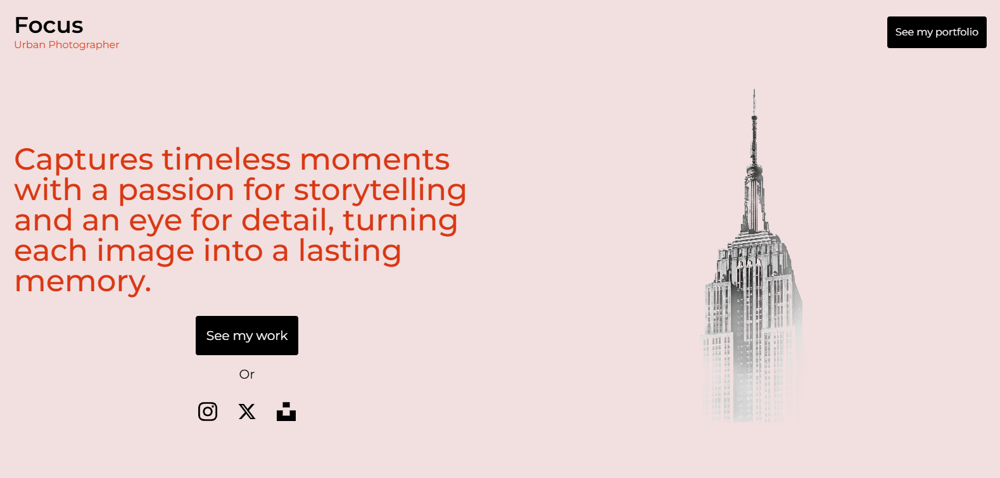
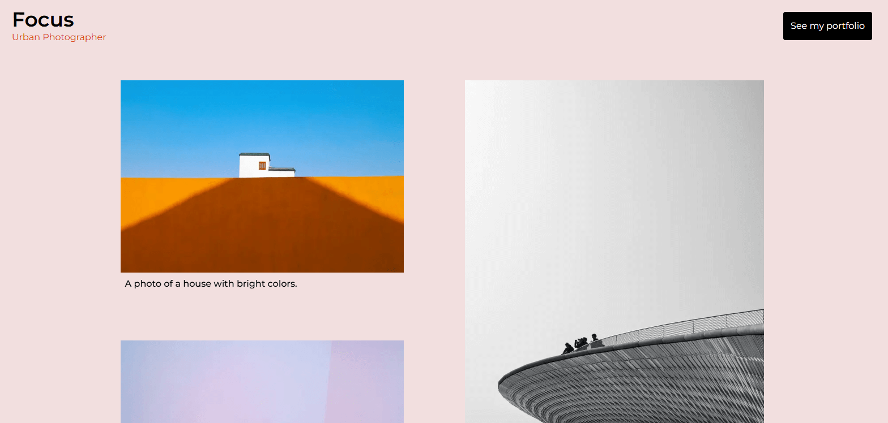

# Description

A minimalist portfolio website designed to keep the user's focus on the content without distractions, featuring a clean layout and subtle scroll animations on desktop for a refined browsing experience. The project leverages a grid layout to organize the gallery section efficiently, providing a cohesive visual structure. It is fully responsive, ensuring optimal viewing and interaction across different devices.

# Main Features
- Next.js
- Grid layout
- Responsive design
- Scroll animations

# Screenshots
## Homepage

## Works page

